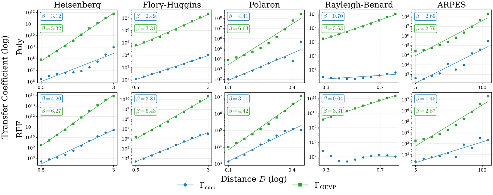

<div align="center">

# Bounds on Extrapolation Across Phase Transitions with Generalized Regression

### [Jeffrey Wei](https://jwei302.github.io)&nbsp;&nbsp;&nbsp;&nbsp;&nbsp;&nbsp;[Manolis Zampetakis](https://mzampet.com)&nbsp;&nbsp;&nbsp;&nbsp;&nbsp;&nbsp;[John Sous](https://sous.yale.edu/profile/john-sous)

NeurIPS 2026

ICML 2026 [AI4Physics Workshop](https://ai4physics-workshop.github.io/)

[Paper](https://openreview.net/pdf?id=gYbqOvL2Ld)&nbsp;&nbsp;&nbsp;&nbsp;&nbsp;[Project Page](https://jwei302.github.io/extrapolation/)

</div>

<p align="center"></p>

This repository contains the code for the paper. We train polynomial regression,
random Fourier features (RFF), Gaussian processes (GP) and neural networks on one
phase of five physical systems and test them on the other phase. For polynomials
and RFF, we bound the transfer coefficient `MSE_Q / MSE_P` with a generalized
eigenvalue problem (GEVP). The bound uses no data from the unobserved phase.

## Installation

The code needs Python 3.11 or newer. Install it with [uv](https://docs.astral.sh/uv/):

```bash
git clone https://github.com/jwei302/extrapolation.git
cd extrapolation
uv sync
source .venv/bin/activate
```

## Datasets

- `heisenberg` (analytic): the free energy of a magnet, which becomes magnetic when cooled below `T_c`.
- `flory_huggins` (analytic): the free energy of a mixture of two liquids, which separates into two layers when cooled below `T_c`.
- `polaron` (simulated): the energy of an electron dragging a lattice distortion, which starts to move with nonzero momentum once the coupling exceeds `lambda_c`.
- `rayleigh_benard` (simulated): the temperature profile of a fluid heated from below, which starts to circulate once the heating exceeds `Ra_c`.
- `arpes` (experimental): the measured electron spectrum of an overdoped cuprate superconductor, whose superconducting gap closes near 90 K.

The two analytic datasets need no preparation. Build the other three once before training:

```bash
python -m data.polaron.simulate            # -> data/polaron/dispersion.npz
python -m data.arpes.convert               # -> data/arpes/edc.npz
python -m data.rayleigh_benard.simulate    # -> data/rayleigh_benard/profiles.npz
```

The Rayleigh-Benard command runs 64 simulations, one per Rayleigh number, in
sequence. To run them in parallel on a SLURM cluster, submit a 64-task array job
in which task `i` runs simulation `i`, then combine the results:

```bash
python -m data.rayleigh_benard.simulate $SLURM_ARRAY_TASK_ID   # tasks 0 to 63
python -m data.rayleigh_benard.simulate gather
```

The ARPES measurements are from He et al., [*Phys. Rev. X* **11**, 031068 (2021)](https://doi.org/10.1103/PhysRevX.11.031068),
and were also studied in Chen et al., [*Newton* **1**, 100066 (2025)](https://doi.org/10.1016/j.newton.2025.100066),
whose ARPES data are public on [Figshare](https://doi.org/10.6084/m9.figshare.25439632.v1).

## Reproducing the paper

Run the three stages in order:

```bash
python train.py                              # train the models   -> results/models/
python experiments.py                        # run the experiments -> results/
python figures.py --figure all --table all   # figures -> figs/, tables -> results/
```

Each stage can also run a subset. Pass `--list` to a stage to see its options:

```bash
python train.py --list
python train.py --dataset heisenberg --method poly,rff
python experiments.py --experiment distance,convergence
python figures.py --figure landscape,slices
```

`train.py` skips models that already exist. If a run stops, run the same command
again to continue. The hyperparameters in `configs/<dataset>.py` are the ones
selected in the paper (Tables 4 and 5).

To run a stage as a SLURM job, use `slurm.sh`. It requests a GPU for `train` only.
Change its partition names to match your cluster.

```bash
./slurm.sh train --dataset heisenberg
./slurm.sh experiments --experiment distance
```

## Layout

```
train.py          stage 1: train the models
experiments.py    stage 2: run the experiments
figures.py        stage 3: make the figures and tables
slurm.sh          submit a stage to SLURM
utils.py          shared helpers

configs/          hyperparameters, one file per dataset
data/             datasets, one Dataset subclass per dataset
models/           one training script per method
eval/             experiments, metrics and bounds
plot/             plotting code
figs/             paper figures, written by stage 3
docs/             project page
```

## Adding a dataset

1. Create `data/<name>/<name>.py`. In it, subclass `Dataset` and name the class
   after the folder in CamelCase, so `flory_huggins` becomes `FloryHuggins`. Set
   the critical point, the two intervals, the range of the second coordinate and
   the plot labels, and define the target `f(T, m)`:

   ```python
   from data import Dataset


   class Heisenberg(Dataset):
       DISPLAY = "Heisenberg"
       TC = 1.5                       # critical point
       T_INTERP = (2.0, 3.0)          # training interval P
       T_EXTRAP = (1.0, 2.0)          # extrapolation interval Q
       M_RANGE = (-1.25, 1.25)        # range of the second coordinate
       TUNING_SYMBOL, TUNING_NAME, TUNING_CRIT, TUNING_UNIT = "T", "Temperature", "T_c", ""
       M_LABEL, F_LABEL, ORDER_LABEL = "$m$", "$f(T,m)$", r"$|m^*(T)|$"

       def f(self, T, m):
           return 0.5 * (1 - self.TC / T) * m**2 + (self.TC / T) ** 3 * m**4 / 12 + 0.01
   ```

2. Copy `configs/heisenberg.py` to `configs/<name>.py`. Set the hyperparameters
   of each method, the GEVP jitter in `NUMERICS` and the distances of the
   distance sweep in `DISTANCES`.
3. Add `<name>` to `ORDER` in `data/__init__.py` to choose its column in the
   figures that show every dataset. Otherwise it goes in the last column.
4. Give the dataset a panel in `fig_order_parameter` in `plot/paper_figures.py`.
   That figure has five fixed panels, one per current dataset.

Every stage now accepts the dataset, for example `python train.py --dataset <name>`.

The `Dataset` base class handles sampling, the evaluation grid and the distance
sweep. Override these only if its defaults do not suit your dataset:

- `sample_T`: how the tuning parameter is sampled. The default is uniform.
- `SWEEP_WIDTH` and `SWEEP_EXTRAP`: the width of the training interval and the
  extrapolation interval in the distance sweep. The defaults keep `T_INTERP`'s
  width and `T_EXTRAP`.
- `T_FULL`: the range of the tuning parameter in the landscape figure. The
  default spans both intervals.

## License

The code is released under the MIT License (see [LICENSE](LICENSE)). The ARPES
data in `data/arpes/` are from He et al. (2021) and are distributed under
CC-BY 4.0.

## Citation

```bibtex
@inproceedings{wei2026extrapolation,
  title     = {Bounds on Extrapolation across Phase Transitions with Generalized Regression},
  author    = {Wei, Jeffrey and Zampetakis, Manolis and Sous, John},
  booktitle = {Advances in Neural Information Processing Systems},
  year      = {2026},
}
```
